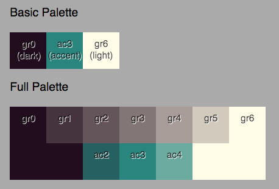
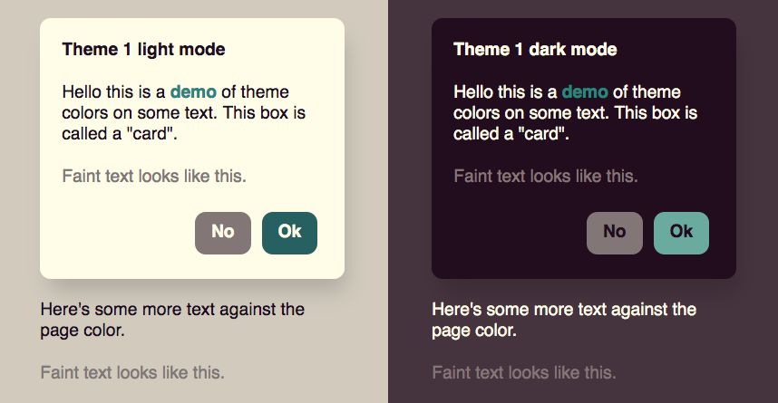

# Make-color-theme

Given 3 input colors, create a full palette of colors in light mode and dark mode.





# Vocabulary

Follow this process for making color themes:

1. **Basic palette** -- you provide 3 colors: light, dark, and accent color
2. **Full palette** -- adds more colors interpolated between the original 3, such as intermediate grays and lighter and darker accent color
3. **Theme** -- assigns colors from the palette to various named roles on a page: page text, button border color, etc etc.
4. **Styles** -- makes actual CSS rules using the theme colors.

## Palettes

A "palette" is a set of colors that have not been assigned roles yet.

We start with a user-provied BasicPalette which only has 3 colors:
```ts
type ColorHexString = string;  // like "#ff9900"

interface BasicPalette {
    gr6: ColorHexString,  // background (white, in light mode)
    gr0: ColorHexString,  // text (black, in light mode)
    ac3: ColorHexString,  // accent color
}
```

That's expanded into a FullPalette with more in-between colors:
```ts
interface FullPalette {
    // a perceptually-uniform gradient between light and dark
    gr6: ColorHexString,  // background (white, in light mode)
    gr5: ColorHexString,
    gr4: ColorHexString,
    gr3: ColorHexString,  // middle gray
    gr2: ColorHexString,
    gr1: ColorHexString,
    gr0: ColorHexString,  // text (black, in light mode)

    // variations on the accent color
    ac4: ColorHexString,  // lighter
    ac3: ColorHexString,
    ac2: ColorHexString,  // darker
}
```

## Theme

A "theme" is a set of colors that have been assigned specific jobs on the page such as text, page background, button border, etc.

```ts
export interface Theme extends FullPalette {
    card: ColorHexString,  // brightest background (in light mode)
    page: ColorHexString,  // medium background
    link: ColorHexString,  // colorful link text
    faintText: ColorHexString,  // gray text
    text: ColorHexString,  // darkest text

    // gray button
    quietButtonBg: ColorHexString,
    quietButtonBorder: ColorHexString,
    quietButtonText: ColorHexString,

    // colorful button
    loudButtonBg: ColorHexString,
    loudButtonBorder: ColorHexString,  // or 'none'
    loudButtonText: ColorHexString,

    textInputBg: ColorHexString,
    textInputText: ColorHexString,
    textInputBorder: ColorHexString,  // or 'none'

    // the raw palette colors are here too, inherited from FullPalette:
    /*
    gr6: ColorHexString,  // background (white, in light mode)
    gr5: ColorHexString,
    gr4: ColorHexString,
    gr3: ColorHexString,  // middle gray
    gr2: ColorHexString,
    gr1: ColorHexString,
    gr0: ColorHexString,  // text (black, in light mode)

    ac4: ColorHexString,  // accent color lighter
    ac3: ColorHexString,  // accent color
    ac2: ColorHexString,  // accent color darker
    */
}
```

## Styles

Finally, Styles are actual CSS rules.  You will want to write your own, but an example is provided in [example-styles.ts](https://github.com/earthstar-project/make-color-theme/blob/main/src/example-styles.ts)

```ts
// example; make your own
let makeStyles = (theme: Theme): Styles => ({
    sPage: {
        background: theme.page,
        color: theme.text,
    }
    sCard: {
        background: theme.card,
        color: theme.text,
        padding: 10,
        borderRadius: 5,
        boxShadow: '5px 15px 20px -5px rgba(0,0,0,0.17)',
    }
    sLoudButton: {
        background: theme.loudButtonBg,
        color: theme.loudButtonText,
        borderRadius: 10,
        padding: theme.loudButtonBorder === 'none' ? '8px 13px' : '10px 15px',
        margin: '2px 5px',
        fontWeight: 'bold',
        display: 'inline-block',
        border: theme.loudButtonBorder === 'none' ? 'none' : '2px solid ' + theme.loudButtonBorder,
    }
})
```

# API

## Example usage

```ts
import {
    invertBasicPalette,
    makeFullPalette,
    makeLightAndDarkThemes,
    paletteIsLight,
} from 'make-color-theme';

// Start with your basic colors, maybe picked by the user.
let basicPalette = {
    gr0: '#222222',  // text
    gr6: '#ffffff',  // background
    ac3: '#775500',  // accent
}

// Normalize it to light mode, no matter how it started off.
// (Light mode means the background, gr6, is brighter than text, gr0)
if (!paletteIsLight(basicPalette) {
    basicPalette = invertBasicPalette(basicPalettte);
}

// expand to a full gradient of colors
let fullPalette = makeFullPalette(basicPalette);

// assign them to roles on the page, and make light and dark versions
let { lightTheme, darkTheme } = makeLightAndDarkThemes(fullPalette);

let myTheme = lightTheme;

// make your actual CSS styles
let loudButtonStyle = {
    background: theme.loudButtonBg,
    color: theme.loudButtonText,
    // ... etc
    // this part is up to you
}
```

## Palette functions

```ts
// "light mode" means text (gr0) is dark and background (gr6) is bright.

// toggle a palette between light and dark mode
invertBasicPalette(p: BasicPalette) => BasicPalette
invertFullPalette(p: FullPalette) => FullPalette

// check if a palette is light or dark
paletteIsLight(p : BasicPalette | FullPalette) => boolean

// ensure that a palette is specifically in light mode or dark mode,
// no matter how it starts off
forceBasicPaletteToLightMode(p: BasicPalette) => BasicPalette
forceBasicPaletteToDarkMode(p: BasicPalette) => BasicPalette
forceFullPaletteToLightMode(p: FullPalette) => FullPalette
forceFullPaletteToDarkMode(p: FullPalette) => FullPalette
```

## Color math

Some of these color functions use a different representation for colors: an object with `r`, `g`, and `b` properties.

Convert between that format and regular hex strings:

```ts
type ColorRGB = {
    // floats between 0 and 1
    r: number,
    g: number,
    b: number,
}

cToHexString = (c: ColorRGB) => string  // like "#ff9900"
cFromHexString = (s: ColorHexString) => ColorRGB | null
```

Linear interpolation between colors:

```ts
// "t", a float between 0 and 1, controls the interpolation.

// as color objects
cLerp(c1: ColorRGB, c2: ColorRGB, t: number) => ColorRGB

// as hex strings
cLerpStr(c1s: ColorHexString, c2s: ColorHexString, t: number) => ColorHexString
```

Compute the [perceptual luminance](https://www.w3.org/TR/WCAG/#dfn-relative-luminance) and [contrast ratio](https://www.w3.org/TR/WCAG/#dfn-contrast-ratio) as defined by the Web Content Accessibility Guidelines.

```ts
luminance(c: ColorRGB): number  // between 0 and 1
contrastRatio(c1: ColorRGB, c2: ColorRGB): number  // between 1 and 21
```
